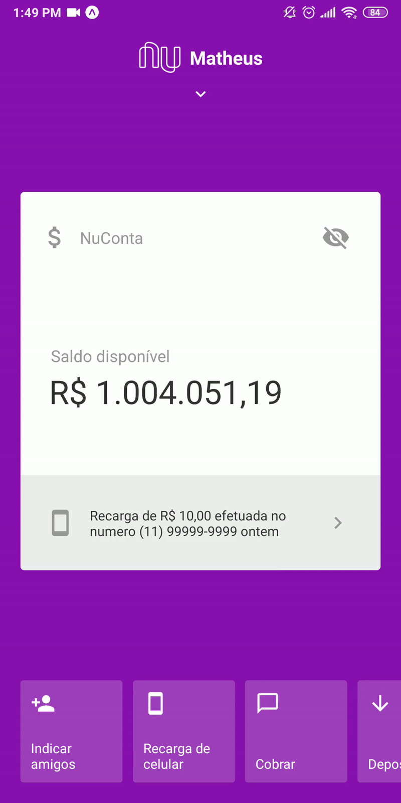

<h1 align="center">
<br>
  
<br>
<br>
Nubank Interface Clone
</h1>

<p align="center">This project is a Nubank interface clone</p>

<div align="center">
  
  
</div>

<hr />


## :rocket: Features

- ⚛️ **React Native** — A lib that provides a way to create native apps for Android and iOS
- :calling: **Expo** - a framework and a platform for universal React applications 
- :gem: **React Native Animated** - a React Native library
- :hand: **React Native Gesture Handler** - Declarative API exposing platform native touch and gesture system to React Native

## Getting started

### Installing

**Cloning the Repository**

```
$ git clone https://github.com/codingwithmath/nubank-clone

$ cd nubank-clone
```

**Installing dependencies**

```
$ yarn
```

With all dependencies installed and the environment properly configured, you can now run the application:

```
$ yarn start
```